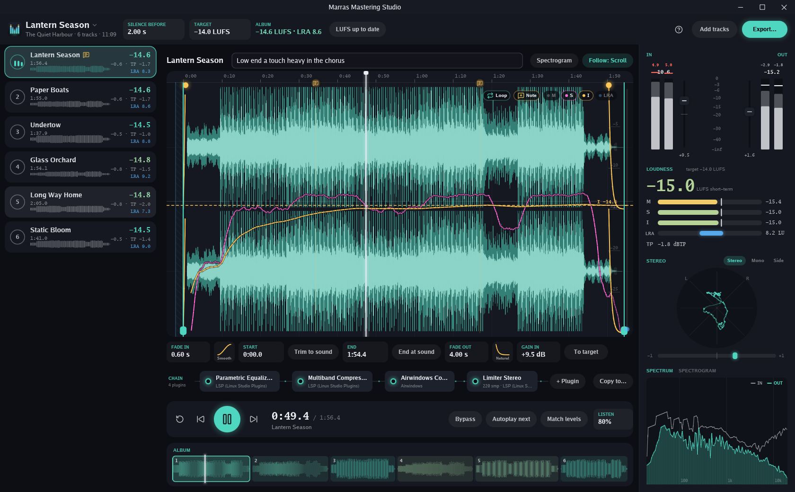
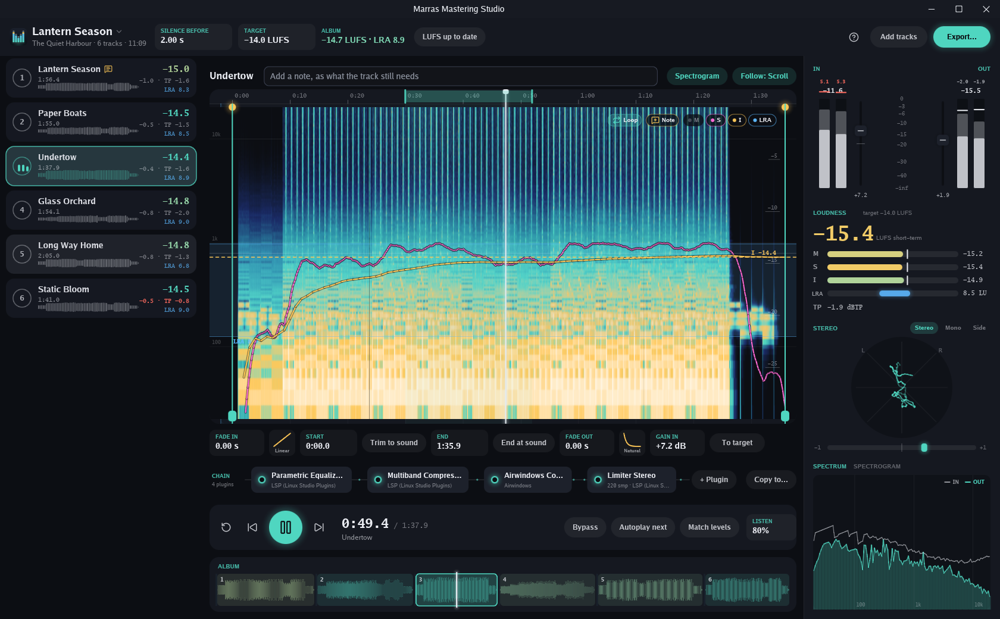

# Marras Mastering Studio

Marras Mastering Studio masters an album, an EP or a single. You cut and
fade each track, run it through its own chain of VST3 plugins, compare
the tracks by ear at matched loudness, and export them to WAV and MP3,
measured and tagged.



## Download

Download the program for your system from the
[latest release](https://github.com/marrasen/mastering-studio/releases/latest):
`mastering-studio_<version>_windows_amd64.exe` for Windows, or
`mastering-studio_<version>_linux_amd64` for Linux. That one file is the
whole program and its own installer. Run it, and it offers to install
itself for you alone, with no administrator needed: into
`%LOCALAPPDATA%\Programs` on Windows, with a Start menu entry, and into
`~/.local/share` on Linux, with an entry among your applications. Projects
then open in it with a double-click, and it can keep itself up to date
from the releases here: by itself, or, if you untick that as you
install, by asking first when a new release is out. Tick Beta updates
in the project menu to take pre-releases too, to try a release before
it is out. Installed apps on Windows removes it again, and
so does `mastering-studio -uninstall`. "Or run it without installing"
runs the downloaded file as it is.

The program is unsigned, so Windows may warn about an unknown publisher
the first time: choose More info, then Run anyway.

To try it without music of your own, run it once with `-demo` and a
folder. It writes six short demo songs there, and a project of them:

```sh
mastering-studio -demo C:\Temp\demo
```

## What it does

**Tracks.** Drop audio files on the track list, or use Add tracks. WAV,
FLAC, MP3 and Ogg Vorbis all work, at their own sample rates. Drag the
rows to set the order. Double-click a title to rename the track, and
drop a new file on the waveform to replace a mix and keep its edit and
chain.

**Editing.** Each track is cut at a start and an end, faded in and out
with one of five curve shapes, and set apart from the track before by
the same silence. Edit on the waveform or on the spectrogram. The
waveform zooms in to the samples themselves, and a slider at its right
draws quiet sound louder. Notes go on a track, and at times along it.

**Listening.** One track plays at a time. Press a number key to switch
to another as far through the music, so you compare them by ear; a
button by the transport's next switches at the same time instead, or
from the track's start.
Match levels plays every track at the target loudness. Bypass plays the
mix as it came, in time with the master, and with Match levels on it
plays at the target loudness too. A loop
plays a stretch over and over. Autoplay next runs on into the next track
with no gap, as the exported files will play. Listen in mono, or to the
side channel alone.

**A/B and references.** Two listening sessions, A and B, sit above the
track list. Each has its own track, place, play state and loop. Press S,
or click the other card, to switch: each takes up where it was left.
With Play on in background, the session you don't hear keeps running,
and its card shows where it has got to. Reference tracks, such as
finished masters to compare with, sit at the foot of the track list.
They are the same in every project, have no silence before them, and
are measured, edited and run through plugins like the album's tracks.
They are never exported. Match levels covers both sessions.



**Plugins.** Each track has its own chain of VST3 plugins, such as
Ozone. Only the track you hear runs its plugins, so the rest cost the
computer nothing. Open a plugin's own window from the chain. Copy a
chain to other tracks with every plugin as set. The studio compensates
for each plugin's latency. Measure loudness also measures how much louder or
quieter each plugin makes the track, and the loudness range out of it;
its card shows both, and a band behind the chain, as tall as the range,
shows each plugin widening or narrowing it. With Match
levels on, a bypassed plugin is played as that gain, so you compare its
sound and not its level. Right-click a card to rename it, as when the
same plugin is in the chain twice. The Chain menu copies the chain to
other tracks, and keeps it as a preset, every plugin as set, to load on
any track of any project.

**Measuring.** Tracks are measured as they will be exported, through a
copy of their chain run offline: integrated loudness (LUFS), loudness
range (LRA) and true peak. Any change marks a track, and Measure loudness
measures the marked tracks, so heavy plugins work only when you ask. To
target finds the gain that brings a track to the target. The album's
loudness is measured over all its tracks together. The loudness curves
along a track show where it is loud and where it is quiet.

**Meters.** The input to the chain and its output each have a peak and
RMS meter with a fader for the gain. Beside them are the loudness
against the target, the stereo image and correlation, and the spectrum
in and out of the chain, or a spectrogram.

**Exporting.** Export writes each track at its own length, several at
once, to 16 or 24-bit WAV with dither, or 32-bit float. With
[LAME](https://lame.sourceforge.io/) installed, it writes MP3 as well.
Each file is tagged with the artist, release, title and track number.
A text report of the export is written if you ask for one. The
export's list marks the tracks with a note, and how many notes at times
each has; Copy notes to clipboard copies them all, to send the artist.

**Projects.** A project is a `.mastering` file. It keeps its tracks'
paths relative to its own folder, so a project opens wherever its
folder and the music move together. Your work is kept as you go, in a
draft beside the settings, and an asterisk after the project's name
shows changes not yet saved; Save (Ctrl+S) writes them to the project.
Closing with changes not saved asks whether to save them, keep the
draft for next time, or discard them. Undo (Ctrl+Z) and redo
(Ctrl+Shift+Z) work across the whole project, and an undo shows the
track it changed.

Press F1 or ? in the studio for every key.

## Building from source

Install [Go](https://go.dev/dl/) 1.27 or later, then:

```sh
go install github.com/marrasen/mastering-studio@latest
```

or, from a clone:

```sh
go run .
go run . mix1.wav mix2.wav
```

It builds without a C compiler, and runs on Windows and Linux. It finds
plugins where VST3 installers put them: on Windows in
`C:\Program Files\Common Files\VST3`, and on Linux in `~/.vst3`,
`/usr/lib/vst3` and `/usr/local/lib/vst3`.

These flags help:

| Flag | What it does |
| --- | --- |
| `-project FILE` | Open this project. By default the studio opens the project open last. |
| `-plugins DIRS` | Look for VST3 plugins in these folders too, as a list like PATH. |
| `-demo DIR` | Write six demo songs and a project of them to this folder, and open it. Files already there are kept as they are. |
| `-size WxH` | Open the window at this size, as `1680x1040`. |
| `-play` | Start playing the track picked. |
| `-shot FILE` | Write the window to a PNG file after `-after`, then quit. |
| `-write-icon FILE` | Write the icon to a PNG file, then quit. |
| `-install` | Install this copy with no window, as a script would, then quit. |
| `-uninstall` | Remove the installed studio, asking first; with `-quiet` too, asking nothing. |

A release is built by pushing a tag such as `v0.1.0`; a tag with a
pre-release in it, such as `v0.3.0-beta.1`, is published as a GitHub
pre-release, which only copies with Beta updates ticked take. The
[Release workflow](.github/workflows/release.yml) builds the programs for
Windows, with its icon, and for Linux, and publishes them with a
`SHA256SUMS` of both and its signature, `SHA256SUMS.sig`. Installed
copies that keep themselves up to date fetch the new release from
there, checked against those sums, and run it only when the signature
matches the public key in `install.go`. The workflow signs with the
private key, kept as the repository's `GUNIM_SIGN_KEY` secret; a
release without it fails to build. See "Signed updates" in gunim's
[`install` documentation](https://pkg.go.dev/github.com/marrasen/gunim/install)
for how the key was made and what to do to change it.

## Built with gunim

The studio is drawn with [gunim](https://github.com/marrasen/gunim), a
GPU interface toolkit in pure Go. Its meters, spectrum, waveform and
loudness displays come from gunim's `audioui` package, its VST3
hosting from `audio/vst3`, and its installer and updates from
`install`.

## Licence

Apache License 2.0. See [LICENSE](LICENSE) and [NOTICE](NOTICE).

VST is a registered trademark of Steinberg Media Technologies GmbH.
